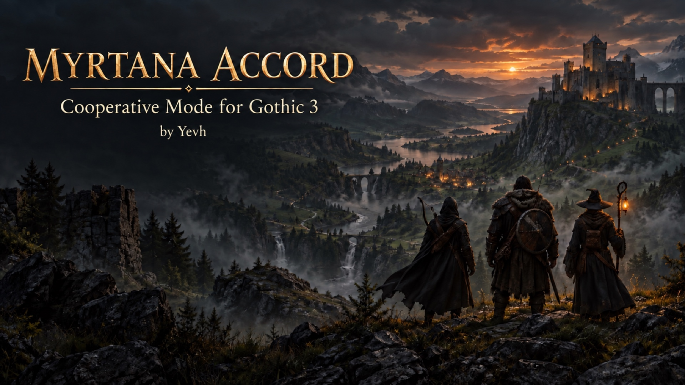
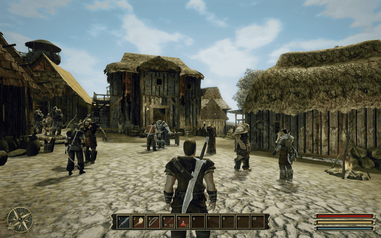
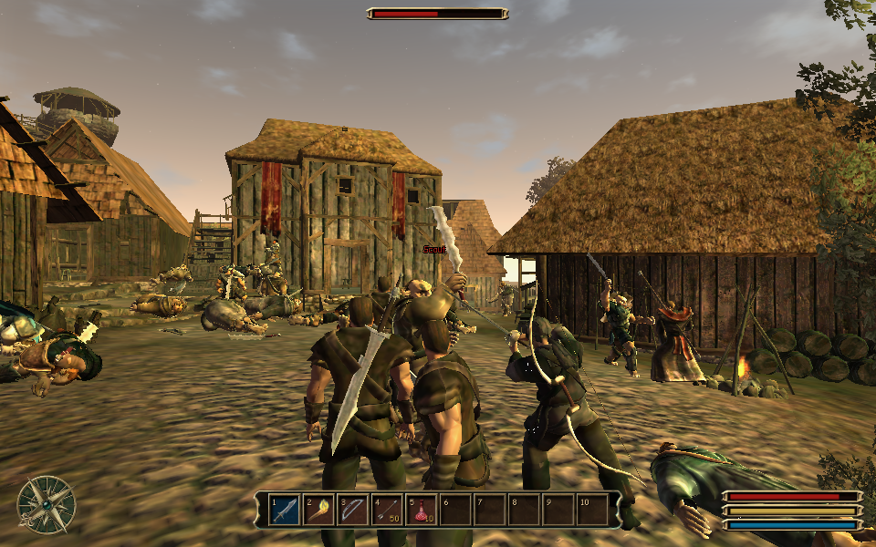
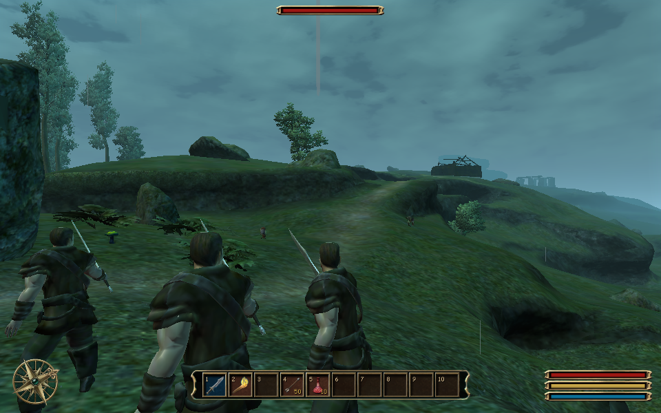
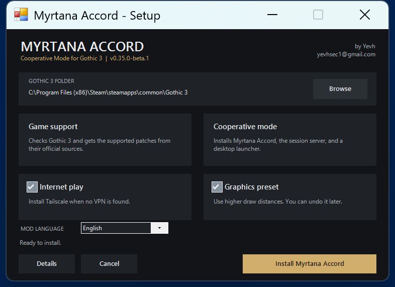
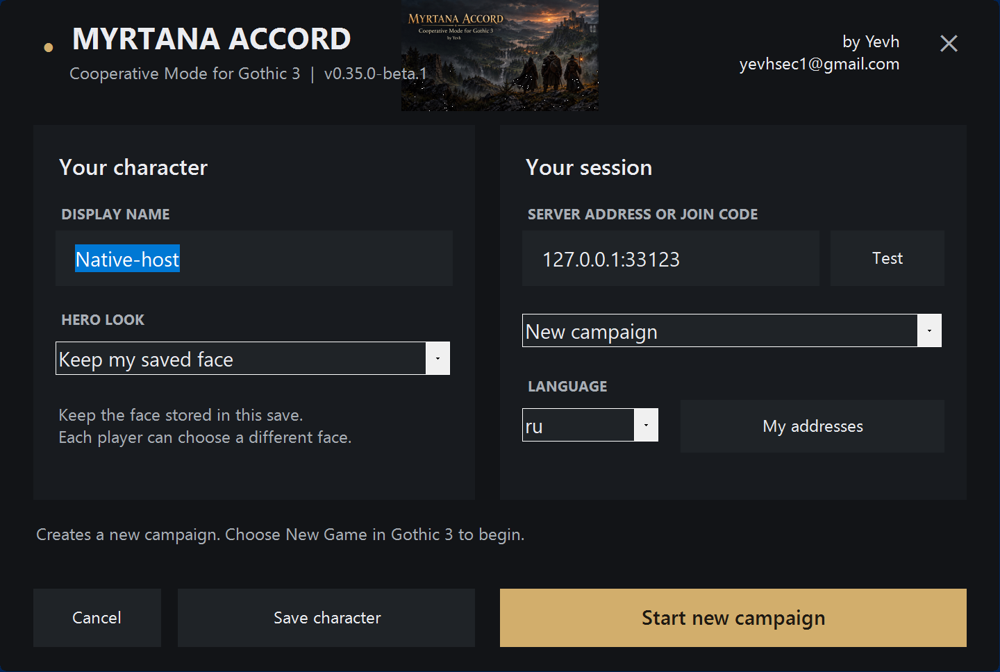

  

# Myrtana Accord

### Cooperative Mode for Gothic 3

Play Gothic 3 with friends. Host a campaign, explore the same world, fight
together, and keep your own character and progress.

- **Version:** `v0.35.0-beta.1`
- **Created by:** Yevh
- **Contact:** [yevhsec1@gmail.com](mailto:yevhsec1@gmail.com)

[**Download Myrtana Accord for Windows**](https://github.com/yevh/Gothic3/releases/tag/v0.35.0-beta.1)

[Download the ZIP directly](https://github.com/yevh/Gothic3/releases/download/v0.35.0-beta.1/Myrtana-Accord-v0.35.0-beta.1-win32.zip)

SHA-256: `C2C5B2752755AAD7D27009CC04BC47C515F93B32F0E2409B039AB0FDF8D0AE4E`

> This is an open beta. Back up important saves before testing.

## See it in action

Click the animation to open the **12-second gameplay video**.

### Cooperative battle in Ardea

### Cooperative party travelling together

### One-click installer

### Create or join a campaign

## Install

You need Windows and a legal installation of Gothic 3.

1. [Download Myrtana-Accord-v0.35.0-beta.1-win32.zip](https://github.com/yevh/Gothic3/releases/download/v0.35.0-beta.1/Myrtana-Accord-v0.35.0-beta.1-win32.zip).
2. Extract the entire ZIP into a new folder.
3. Run **Install Myrtana Accord.cmd** and approve the administrator prompt.
4. Complete setup and open **Myrtana Accord** from the desktop.

The installer checks the game, gets the supported patches from their official
sources, installs the mod, and creates a desktop shortcut. Gothic 3 and patch
files are not included in the download.

## Play with friends

The host selects **New campaign** or **Continue campaign**. Friends select
**Join / rejoin friends** and enter the host address or join code. Every player
must use the same Myrtana Accord version.

Your PCs must be able to reach each other on the same local network or a shared
private VPN. If you are in different homes, install
[Tailscale](https://tailscale.com/download) on every PC and give friends access
to the host's Tailscale network. The installer can prepare Tailscale for you.
[ZeroTier](https://www.zerotier.com/download/) is another option. Everyone must
join the same ZeroTier network. Friends then enter the host's LAN or VPN address
in **Join / rejoin friends**. See [internet play](docs/INTERNET_PLAY.md) for the
full steps.

## Beta status

We installed this release on separate Gothic 3 1.75 copies. Multiple game
clients launched, connected, entered the game, and closed without recorded
debugger faults. All 38 automated tests passed on macOS and Windows.

The beta still needs more player testing for:

- Teammate death and revival.
- Unique treasure after reconnecting.
- A full cooperative combat, quest, reconnect, save, and reload session.

When reporting a problem, tell us what happened and what each player was doing.
Please attach the generated debug bundle.

## Contact

Questions, testing reports, collaboration, and distribution requests:
**Yevh - [yevhsec1@gmail.com](mailto:yevhsec1@gmail.com)**

Myrtana Accord is an unofficial fan-made modification. Gothic 3 and its names,
artwork, and game content belong to their respective owners. This project requires
a separately purchased copy of the game.

## Support

If you want to support development:

- **BTC (Bitcoin network):** `bc1q5hwjrdrdwdzx409jxzhwzq5nkws6sale246wde`
- **ETH (Ethereum network):** `0x4357FbA55494d10a3AC564A6BecaB6387a723a0B`
- **USDT (TRON network):** `TVd1jehNaGt2YwL3rNiK5VzZbx1CGvRAa8`
